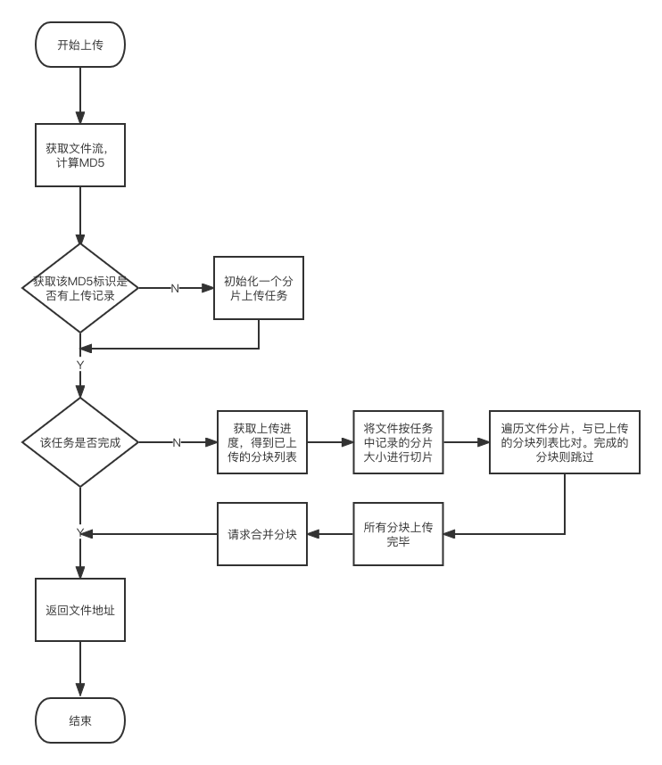

### 部署
单机无纠删码模式：只指定一个磁盘目录，bucket下直接就是源文件
```shell
docker run -d \
  -p 9000:9000 \
  -p 9001:9001 \
  -e "MINIO_ROOT_USER=admin" \
  -e "MINIO_ROOT_PASSWORD=admin@123" \
  -v /usr/local/docker/minio/data:/data \
  minio/minio server /data --console-address ":9001"
```


### 分片上传、断点续传
[]
#### 问题
需要使用Promise-Queue-Plus库来管理文件上传的流程，特别是如何创建和存储队列实例，以及如何控制特定队列的暂停。在handleUpload方法中，为每个文件创建一个队列，并将上传任务按部分添加到队列中。UploadChunkQueue对象用于存储各个文件上传队列，以便后续操作如stopProgress能暂停指定文件的上传进程。
这个组件找不到js引用地址。
